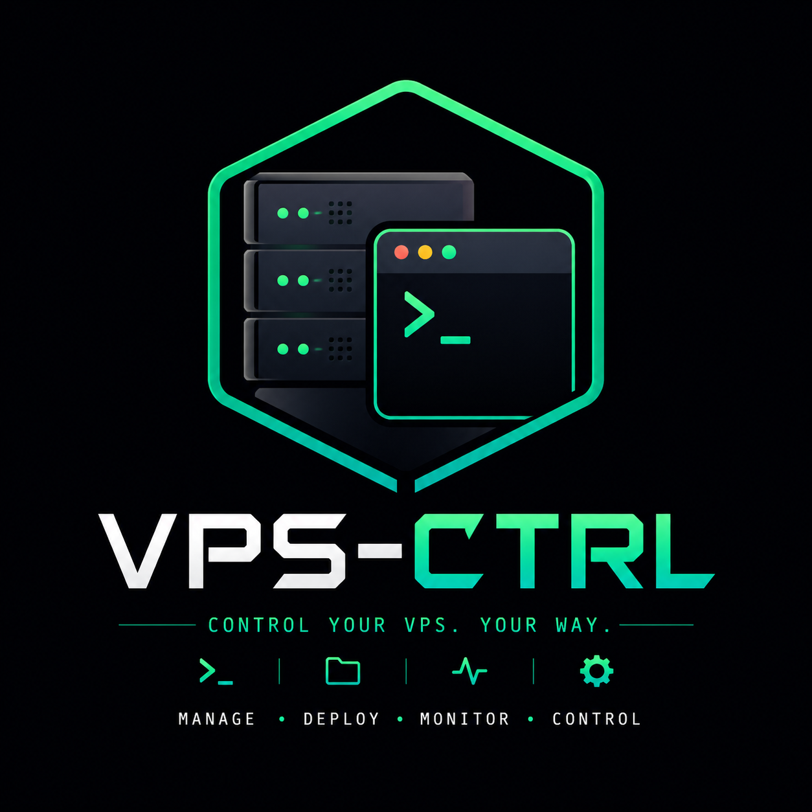
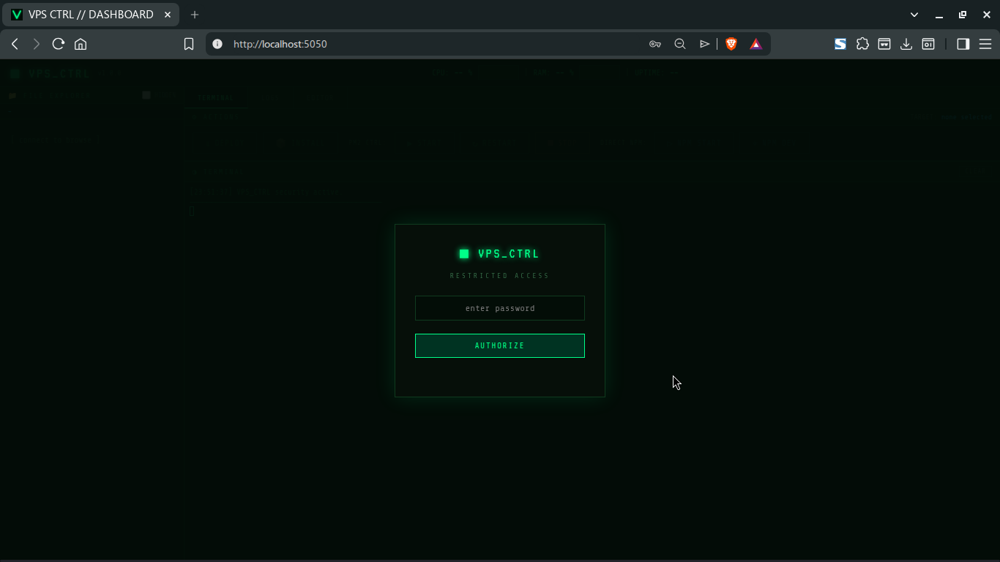
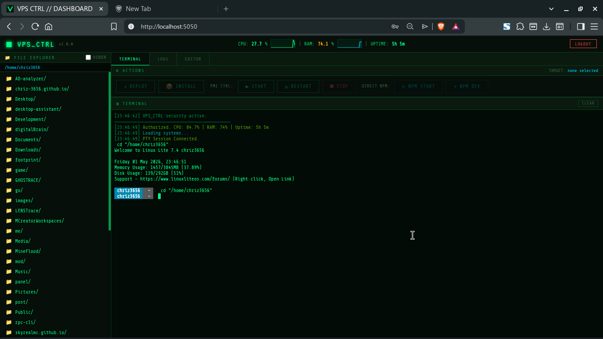
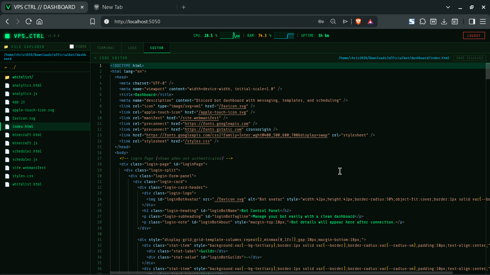

<p align="center">
  
</p>

<h1 align="center">VPS-CTRL 🚀</h1>

<p align="center">
  <b>Lightweight self-hosted VPS management panel</b><br>
  The terminal-inspired command center for modern developers.
</p>

<p align="center">
  
  
  
</p>

---

### 📌 Intro

**VPS-CTRL** is a lightweight, high-performance web dashboard that bridges the gap between raw SSH and complex enterprise panels. It provides a secure, web-based environment to monitor system health, explore files, edit code, and manage processes without ever opening a separate SSH client.

Stop wrestling with terminal multiplexers and complex SSH keys. Manage your entire VPS from a single, unified, and beautiful interface.

---

### ❓ Why VPS-CTRL?

*   **No SSH Dependency:** Access your server's core from any browser, anywhere.
*   **Web-Based Control:** Full file explorer, code editor, and interactive terminal in one tab.
*   **Ultralight:** Minimal memory footprint, built with vanilla technologies for maximum speed.
*   **Developer-Focused:** Optimized for managing Node.js apps, Discord bots, and personal web projects.

---

### ⚡ Features

*   **📊 Live Monitoring:** High-resolution CPU/RAM tracking with real-time mini-graphs.
*   **📁 File Explorer:** Sophisticated filesystem navigation with hidden file support.
*   **🖥️ PTY Terminal:** Full-blown interactive pseudo-terminal (`xterm.js`) supporting `nano`, `vim`, and `top`.
*   **📝 Monaco Editor:** The power of VS Code in your browser with syntax highlighting and remote saving.
*   **🚀 Process Manager:** Dedicated tab to monitor running apps, view active ports, and manage PIDs.
*   **⚙️ Smart Actions:** One-click deployment for Git, NPM, and PM2 workflows.

---

### 🖼️ Screenshots

<p align="center">
  <i>(Main Dashboard - System metrics and terminal sync)</i><br>
  
</p>

<p align="center">
  <i>(Interactive Terminal - Full PTY support)</i><br>
  
</p>

<p align="center">
  <i>(Code Editor - Monaco integration with custom theme)</i><br>
  
</p>

---

### ⚙️ Installation

#### One-line Install (Recommended)
```bash
bash <(curl -s https://raw.githubusercontent.com/chriz-3656/VPS-CTRL/main/scripts/install.sh)
```

#### Manual Installation
1.  **Clone the core:**
    ```bash
    git clone https://github.com/chriz-3656/VPS-CTRL.git
    cd VPS-CTRL
    ```
2.  **Install dependencies:**
    ```bash
    npm install
    ```
3.  **Configure environment:**
    ```bash
    cp .env.example .env
    # Edit to set your DASHBOARD_KEY
    nano .env
    ```
4.  **Launch system:**
    ```bash
    npm start
    ```

---

### 🧠 Usage

1.  **Authorize:** Enter your `DASHBOARD_KEY` on the secure login screen.
2.  **Explore Files:** Use the File Explorer to navigate. The Terminal will automatically sync its path.
3.  **Run Commands:** Execute any shell command in the Terminal tab or use predefined Actions.
4.  **Manage Apps:** Switch to the Processes tab to monitor system load or kill stuck ports.
5.  **Edit Code:** Double-click any file to open it in the Editor. Save with `Ctrl+S`.

---

### 🔐 Security

*   **JWT Authentication:** All management endpoints are protected by encrypted session tokens.
*   **Secure Cookies:** `HttpOnly` and `SameSite` flags protect against XSS and CSRF.
*   **Environment Isolation:** Child processes are sandboxed to prevent port conflicts with the dashboard.
*   **Strict Path Validation:** Operations are jailed to the system home directory to prevent traversal attacks.

---

### 🎯 Use Cases

*   **Discord Bots:** Monitor uptime and update source code instantly.
*   **Web Applications:** Deploy new versions with `git pull` and `npm install` via UI.
*   **Personal Dev Panel:** A lightweight alternative to heavy panels like Pterodactyl or Plesk.

---

### 🛣️ Roadmap

*   [ ] **Multi-User Support:** Role-based access control for teams.
*   [ ] **Docker Integration:** Manage containers and view logs directly.
*   [ ] **Mobile Optimization:** A dedicated mobile-responsive UI mode.

---

### 🤝 Contributing

Contributions are what make the open source community such an amazing place to learn, inspire, and create. Any contributions you make are **greatly appreciated**.

1. Fork the Project
2. Create your Feature Branch (`git checkout -b feature/AmazingFeature`)
3. Commit your Changes (`git commit -m 'Add some AmazingFeature'`)
4. Push to the Branch (`git push origin feature/AmazingFeature`)
5. Open a Pull Request

---

<p align="center">
  <b>VPS-CTRL</b><br>
  Built with 💚 by <a href="https://github.com/chriz-3656">chriz-3656</a>
</p>
